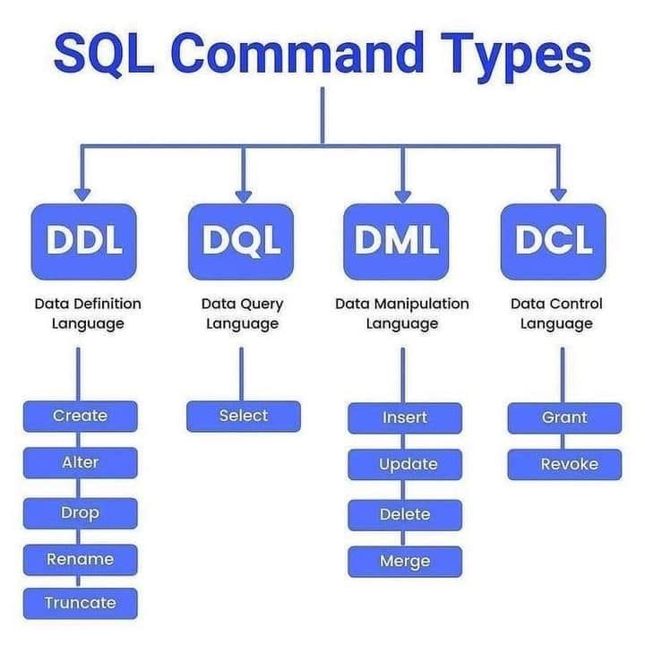
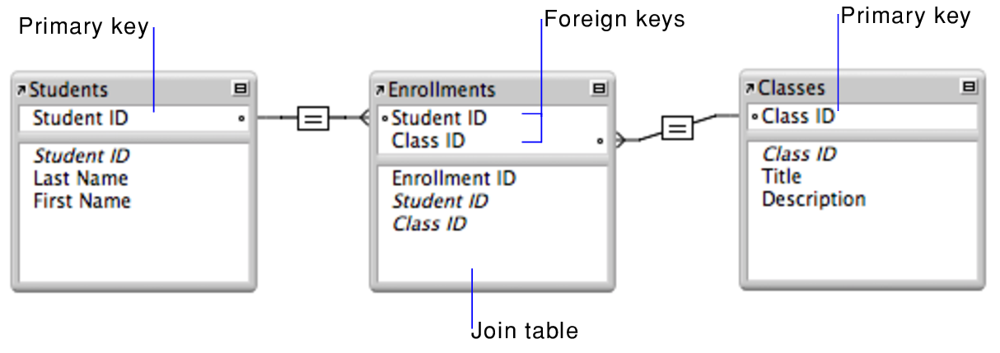

# Index
- [Introdução](#introdução)
- [Tipos de Dados](#tipos-de-dados)
- [Manipulação de dados](#manipulação-de-dados)
- [Operadores](#operadores)
- [Relações](#relações)
- [Gerenciamento de Dados](#gerenciamento-de-dados)
- [Comandos](#comandos)
- [Métodos](#métodos)
- [Funções](#funções-de-agregação)
- [Relacionamentos entre tabelas](#relacionamentos)

# Introdução
SQL é uma linguagem quase que universal entre os bancos de dados, a ideia do banco de dados relacional surgiu em 1970 pelo Edgar Codd, onde ele sugeriu esse modelo a partir da teoria matemática das relações entre conjuntos. Se baseando em relações de álgebra para manipulação de dados.

A ideia central consiste em pegar informações do mundo real e definir entidades em campos, com informações úteis para serem manipuladas e relacionadas com outros BD. Exemplos de DBMS - Sistema Gerenciador de Banco de Dados -  Sequels: MySQL, Oracle e **SQL Server**.

 Esses bancos são baseados em tabelas, agrupando tipos diferentes de informação a um identificador - ID - para ser feito relacionamento de tabelas. A manipulação tem dois pilares, o esquema e o comandos de gerenciamento.

Esquema é pegar dados e transformar em informações útils que conversem entre si, enquanto os comandos é a maneira de manipular o banco e basicamente podem ser divididos em:

Definição de dados > Manipulação de dados > Controle e transição de dados > consulta de dados

Cada tipo de comando é responsável por alguma categoria de manipulação, desde definição, configuração, até requisições e visualizações.



[VOLTAR AO TOPO](#index)

## Tipos de dados

### String

- Char: Tamanho fixo e consome todo o valor reservado
- varchar: tamanho variável e consome só o tamanho usado
- text: Tamanho variável, recebe até 2gb de caracteres

### Numéricos

- tinyint, smallint, int, bigint : valores numéricos inteiros suportando tamanhos variáveis
- float, real : valores numéricos aproximados, recebem casas decimais (1.4)

### Temporais

- date : formato aaaa\mm\dd
- datetime : formato aaaa\mm\dd:hh:mm:ss
- time : apenas o tempo com milisegundos hh:mm:ssssssss
- datetime2 : também registra os milisegundos aaaa\mm\dd:hh:mm:ssssssss
- smalldatetime : recebe data e hora, mas apenas entre 1900\01\01:00:00:00 e 23\59\59.9999999

[VOLTAR AO TOPO](#index)

### Manipulação de dados
```sql
/* Contatenar diferentes textos */
SELECT CONCAT(nome, ' ', sobrenome)
FROM Clientes

/* Retorna a quantidade de caracteres da string */
SELECT LEN(nome)
FROM Clientes

/* Deixar o texto em caixa alta */
SELECT UPPER(nome)
FROM Clientes

/* Deixar a string em letras minúculas */
SELECT LOWER(nome)
FROM Clientes

/* Recebe o campo, o primeiro index e quantos caracteres irá retornar */
SELECT SUBSTRING(nome, 1, 4)
FROM Clientes

/* Recebe um campo e indica algum caractere onde toda persistência dele
	 será substituído por um outro valor - no caso . por - */
SELECT REPLACE(cpf, '.', '-')
FROM Clientes
```
[VOLTAR AO TOPO](#index)

## Operadores
| Operador | Descrição |
| --- | --- |
| < | Menor |
| > | Maior |
| <= | Menor ou igual |
| >= | Maior ou igual |
| = | Igual |
| <> | Diferente |
| + | Adição |
| - | Subtração |
| / | Divisão |
| * | Multiplicação |
| % | Módulo |

## Relações
PRIMARY KEY e FOREIGN KEY

Cada tabela em SQL é uma relação, é no desenvolvimento do esquema de banco que deve ser feita a definição da modelagem que vai definir como será os relacionamentos destas tabelas. Modelagem de banco consiste em separar informações relevantes e evitar repetições, para caso de dados que dependem um do outro é feito o uso das Keys. As chaves primárias e chaves forasteiras - Primary Key e Foreign Key - são o caminho por onde será feito a comunicação entre relações. Exemplo, numa relação de funcionários cada funcionário teu seu ID próprio, que é a Primary Key e no campo de ‘depertamentos’ não há nenhum nome, apenas o ID de departamento, que nesse caso é a Foreign Key. Pois para acessar a informação desse departamento na relação departamentos, o ID dele lá será único, enquanto que na tabela de ‘funcionários’, o ID dos departamentos será uma chave que é estrangeiro pode não ser único.

>

CONFIGURAÇÃO DE ESQUEMA

Para configurar uma relação é passado o comando CREATE TABLE com os campos e as configurações destes campos. Em base a configuração recebe pelo menos um parâmetro podendo receber outros também, pois além dos tipos de dados que cada campo vai receber, também podem ser passadas outras restrições:

- NOT NULL - Campo não pode ficar vazio
- UNIQUE - Não podem haver valores iguais nesta coluna
- PRIMARY KEY - Não pode ser Null e precisa ser Unique
- FOREIGN KEY - Pode receber restrição REFERENCES para indicar de onde vem a FK
- CHECK - Define uma condição específica mais complexa
- DEFAULT - Define um valor padrão em caso de não receber nada como parâmetro

EXEMPLO

Canal 

| Campo | Value |
| --- | --- |
| Canal ID | int PK |
| Nome | varchar not null |
| Inscritos | int default 0 |
| data criação | datatime not null |

Video

| Campo | Valor |
| --- | --- |
| video_id | int PK |
| nome | varchar(150) not null |
| vizualizações | int default 0 |
| likes | int default 0 |
| deslikes | int default 0 |
| duração | int not null |
| canal_id | FK |

```sql
CREATE TABLE canal (
	canal_id INT PRIMARY KEY,
	nome VARCHAR(155) NOT NULL,
	inscritos INT DEFAULT 0,
	data_criacao DATETIME NOT NULL
)

CREATE TABLE video (
	video_id INT PRIMARY KEY,
	nome VARCHAR(150) NOT NULL,
	visualizacoes INT DEFAULT 0,
	likes INT DEFAULT 0,
	deslikes INT DEFAULT 0,
	duracao INT NOT NULL,
	canal_id INT FOREIGN KEY REFERENCES canal(canal_id)
)
```

[VOLTAR AO TOPO](#index)

### Gerenciamento de dados
Após a definição do esquema de dados, é preciso fazer a sua manipulação. Porém é importante levantar dois pontos sobre o comportamento do SQL Server. Primeiro que SQL é uma **linguagem bloqueante**, ao passar comandos e alguma coisa não for compatível com aquilo que o sistema espera, todo o comando não será executado.

Ao mesmo tempo que o filtro da base de dados não é **key sensitive**, ou seja: o sistema não irá diferenciar caracteres lower case de upper case - não diferencia ‘marcos’ de ‘Marcos’ - desde que os campos estejam corretamente indicados, mas quando se trata dos valores o sistema é mais flexível.

### INSERT INTO
Esse comando recebe o a tabela e o campo que será inserido, seguido dos parâmetros de dados que serão colocados nestes campos.
```sql
INSERT INTO canal(canal_id, nome, data_criacao)
VALUES (2, 'Alanzoka', '2022/11/10')
```

### UPDATE
Atualizar valores em linhas da tabela, porém o comportamento padrão do comando é alterar tudo na tabela. Para evitar isso é necessário usar a condição de Where, para esclarecer o campo referente a edição desejada, junto de Set que indica qual o valor que será usado.
```sql
UPDATE canal
SET data_criacao = '2022/11/10'
WHERE canal_id = 1
```

### DELETE
Assim como Update ele altera os dados de toda a tabela, então é preciso indicar a condição de Where, em que neste caso se não for usado irá zerar todos os dados da linha
```sql
DELETE FROM canal
WHERE canal_id = 3
```

### ALTER TABLE
Altera valores de uma tabela, desde os nomes dos campos e alterar restrições. Aqui é feito o controle na alteração de um esquema já definido.
```sql
/* Adcionando uma coluna */
ALTER TABLE canal
ADD verificado bit

/* Alterando as restrições de uma coluna */
ALTER TABLE canal
ALTER COLUMN nome VARCHAR(50) NOT NULL

/* Editando nome da coluna */
EXEC sp_RENAME 'canal.inscritos', 'subs', 'COLUMN'

/* Editando nome da coluna */
EXEC sp_RENAME 'canal', 'canais'
```
*O SQL Server tem uma condição única, onde o nome da coluna deve ser alterada por um comando específico, que recebe o comando:*

_*EXEX sp*RENAME  ‘nomeTabela.nomeColuna’, ‘novoNomeColuna’, ‘COLUMN’_

### DROP TABLE
Exclui toda a tabela da base de dados, desde que não aja nenhuma Foreign Key que faça referência a esta tabela, nesse caso pode ser usado o Tuncate
```sql
DROP TABLE canais
TRUNCATE TABLE canais
```

### CHECK
Verificar uma restrição de dado baseado numa condição
```sql
CREATE TABLE CNH (
	id INT NOT NULL,
	nome VARCHAR(300) NOT NULL,
	idade CHECK (idade >= 18)
)
```

[VOLTAR AO TOPO](#index)

## Comandos
AS - ou Álias - Não é um comando, mas serve para dar nome a cada parâmetro passada e retornar como um apelido para os campos de dados na tabela.
```sql
SELECT FirstName as 'Primeiro Nome', LastName as 'Sobrenome'
FROM Person.Person
```

## Querys

### SELECT
O Comando select faz a seleção de um campo para a leitura, mas para indicar essa seleção é usado um parâmetro + o comando FROM, também com um parâmetro. Basicamente recebe: SELECT campoDesejado FROM tabelaDesejada - sendo o parâmetro ‘ * ‘ indicando todos os campos
```sql
SELECT *
FROM person.Person

SELECT Title
FROM person.person
```

## TOP
gera uma limitação de filtro, trazendo um número máximo de linhas que serão apresentadas.
```sql
SELECT TOP 10 *
FROM products
```

### DISTINCT
A função desse comando é indicar para a leitura que não retorne valores duplicados da busca, ou seja, se uma mesma coluna tem valores idênticos, o SELECT só irá apresentar um deles.
```sql
SELECT DISTINCT FirstName
FROM person.Person
```

### WHERE
Se distinct serve como uma condição para apresentação de pesquisa, o WHERE é um comando condicional que permite mais complexidade na leitura dos dados
```sql
SELECT *
FROM Person.Person
WHERE EmailPromotion <> 0
```

### ORDER BY
Gera uma condição de filtro, recebendo qual a tabela que servirá de parâmetro e se a apresentação será crescente ou descendente
```sql
SELECT *
FROM Person
ORDER BY FirstName asc, lastNAme  desc
```

### BETWEEN
Um comando que retorna os valores filtrados entre um valor e outro. Esse comando também recebe um ‘NOT’ antes dele para retornar o contrário - ou seja, tudo fora daquela condição.
```sql
SELECT *
 FROM Production.Product
 WHERE Weight BETWEEN 500 and 700
```

### IN
Esse comando gera uma condição que busca por todas as persistências desse valor especifico. Também pode receber o NOT que faz justamente o contrário.
```sql
SELECT *
FROM Person
WHERE colorType IN ('green', 'black')
```

### LIKE
Que faz procura por dados semelhantes, quando não temos ou precisamos do nome certo da condição que procuramos. Visto que tudo antes, depois ou entre ‘%’ será feito a busca por caracteres aleatórios, enquanto no uso do unserscore - _ - ele busca apenas por um caractere aleatório.
```sql
SELECT *
FROM Person
WHERE firstname LIKE 'Rob%'
```

## Métodos
### COUNT
Faz a contagem do número de persistências em campos da tabela, exemplo o número de linhas na coluna ‘title’ ou o número único de títulos na mesma coluna
```sql
SELECT COUNT(title)
FROM person.Person

SELECT COUNT(DISTINCT title)
FROM person.Person
```

### MIN - MAX - SUM - AVG
Um pouco semelhante ao COUNT, eles fazem a combinação de todos os dados de uma coluna em um único resultado. O as retorna um nome para o valor final.
```sql
SELECT SUM(standarCost) as "Soma"
FROM products

SELECT MIN(standarCost) as "Valor mínimo"
FROM products

SELECT MAX(standarCost) as "Valor Máximo"
FROM products

SELECT AVG(standarCost) as "Valor médio"
FROM products
```

ARITMÉTICOS
```sql
/* Recebe o campo e qual a condição decimal para arredondar o valor */
SELECT ROUND(total, 2)
FROM Vendas

/* Cálculo da raiz quadrada - square - do valor */
SELECT SQRT(total)
FROM Vendas
```

[VOLTAR AO TOPO](#index)

## Funções de agregação
### GROUP BY
Recebe uma função de agregação que aplica estas funções baseado em um campo especifico. Exemplo, somar o preço de custo de produtos, através dos departamentos individuais
```sql
SELECT departamentid, sum(unitprice) as "Soma dos preços"
FROM sales.products
GROUP BY departamentID
```

### HAVING
Tem finalidade semelhante ao where, porém com uma diferença de comportamento, onde where é uma condição principal, enquanto o HAVING é usado após um agrupamento de dados, como o group by
```sql
SELECT firstname, cout(fisrtname)
FROM person
GROUP BY firstname
HAVING count(firstname) > 10
```

### UNION
Esse comando retorna dois Selects de diferentes tabelas em um só, desde que tenham o mesmo número de tabelas e que elas retornem o mesmo tipo de dado. Por padrão esse comando desconsidera os campos com valores duplicados, a não ser que seja passado UNION ALL
```sql
SELECT coltxt, colnum
FROM tabela1
UNION
SELECT coltxt, colnum
FROM tabela2
```

### SUB-SELECT
Um shorthand para alguns contextos onde é necessário fazer dois Selects - um para retornar uma informação, e outro para fazer uma Query em cima desse dado - o Sub-Select vem para otimizar essa requisição.
```sql
/* Dupla Query */
SELECT AVG(listPrice)
FROM Product

SELECT *
FROM Product
WHERE listPrice > valor

/* Sub Query */
SELECT *
FROM Product
WHERE listPrice > (SELECT AVG(listPrice) FROM Product)
```
*Importante frizar a necessidade de ter a sub query dentro de ( )*

### DATAPORT
Uma função de query que recebe dois parâmetros, a informação buscada - entre dia, mes ou ano - e de qual tabela está sendo retirada.
```sql
SELECT orderdetails, DATEPART(MONTH, orderdate)
FROM sales.orderdetails

/* Também pode ser agregado a operações */
SELECT AVG(totalsales), DATEPART(MONTH, orderdate)
FROM sales.orderdetails
GROUP BY DATEPART(MONTH, orderdate)
```

[VOLTAR AO TOPO](#index)

## Relacionamentos
Ao fazer um JOIN entre duas tabelas, nós agora temos três relações de dados para relacionar. A primeira tabela selecionada é considerada a esquerda, a segunda tabela é considerada a direita e os dados semelhantes entre as duas são o central - inner.


### Apelidos
Após a indicação de uma tabela, é possível atribuir um apelido a ela para ser usada posteriormente
```sql
SELECT *
FROM Person.BusinessEntityAddress PBEA
INNER JOIN Person.Address PA ON PA.AddressID = PBEA.AddressID
```

### Keys
Aqui que iremos tratar de usar as Primary Keys e Foreign Keys, basicamente consistem em uma chave de identificação única na tabela, e a outra é uma chave que é única em outra tabela, mas que pode se repetir na atual.

### INNER JOIN
Faz a união entre duas tabelas, baseada em valores idênticos entre elas.
```sql
SELECT campos
FROM tabela1 t1
INNER JOIN tabela2.t2 ON t2.campoPK = t1.campoFK
```

O que pode ser confuso é o fato de que o Select é feito antes do From, ou seja, para definir os campos é preciso antes saber quais são as tabelas. Para então definir toda a interação entre chaves primárias e secundárias, que vamos indicar os apelidos nos campos da tabela.
```sql
SELECT PP.BusinessEntityID, PNT.Name, PP.PhoneNumber, PNT.PhoneNumberTypeID
FROM Person.PhoneNumberType PNT
INNER JOIN Person.PersonPhone PP ON PP.PhoneNumberTypeID = PNT.PhoneNumberTypeID
ORDER BY BusinessEntityID asc
```

### FULL OUTER JOIN
Join que aplica uma relação entre tabelas independente dos valores serem correlacionados ou não, no caso, se em uma tabela eu tenho dados de id e idades, enquanto na outra tenho id e nomes, mas o número de nomes é superior a idades, esse comando faz o JOIN e automaticamente aplica o valor NULL para os nomes que não possuírem relação com idades - o mesmo acontece se no caso a tabela 2 tiver alguma informação de coluna a mais que na primeira tabela, ele faz o join e aplica o NULL em onde há espaços vazios.
```sql
SELECT *
FROM tabela1
FULL OUTER JOIN tabela2
ON tabela1.nome = tabela2.nome
```

### LEFT OUTER JOIN
O Left Join trás todo o conteúdo relacionado entre duas tabelas, porém não trás campos a mais que existam na segunda tabela, ou seja: ele aplica o valor NULL em todas as informações que existem na tabela 1 mas não existem na tabela 2, essas ele ignora.
```sql
SELECT *
FROM tabela1
LEFT JOIN tabela2
ON tabela1.nome = tabela2.nome
```

### RIGHT OUTER JOIN
Tem o mesmo comportamento do Left Join, porém claramente faz o inverso, trazendo a relação entre os valores das duas tabelas, mas a persistência maior dos dados que estão na segunda tabela, não trazendo novos campos da primeira.
```sql
SELECT *
FROM tabela1
RIGHT JOIN tabela2
ON tabela1.nome = tabela2.nome
```
*A utilidade de Left ou Rigth Joins é no caso de dar preferência a algum tipo de dado, exemplo: trazer dados de cadastro mesmo que alguma informação não foi cadastrada por completo, como cartão, documentação, etc.*

### SELF JOIN
Comando que compara informações dentro da mesma tabela, visto que a condição Where necessita de um parâmetro para comparar e filtrar dados baseado em um valor, mas não permite filtrar informações em cima de colunas. Para isso é aplicado diferentes apelidos para os mesmos tipos de dados na tabela.
```sql
SELECT CA.Name, CA.Region, CB.Name, CB.Region
FROM Costumers CA, Costumers CB
WHERE CA.Region = CB.Region
```

[VOLTAR AO TOPO](#index)
